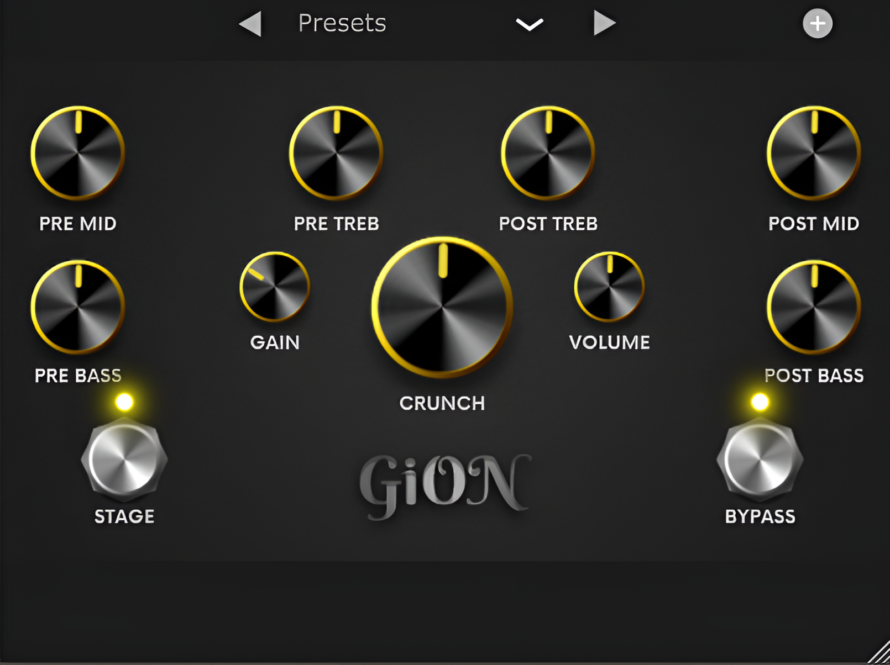

G e F X - G i O N
=================

This is the first entry in the GeFX plugin collection: GiON – a versatile distortion plugin capable of delivering anything from a clean, transparent boost to intense distortion and gritty fuzz. It was heavily insprired by the ingenious Kernom Ridge and the Mood control.

Getting GiON
============

You can download GiON [here](https://github.com/giangthai-0710/gefx-gion/releases/tag/v1.0.0). As of now, only VST3 is supported.

Using GiON is very simple: Just open a DAW of your choice, select GiON from the plugin list and **CRUNCH!**

Using GiON
==========

Parameters
----------
- **Crunch**: Changes the hardness of the distortion applied - GiON's take on the Mood control. At the default **Stage** control, it can seamlessly transition from light overdrive to a very mild distortion.
- **Gain**: Increases the input volume, which increases the amount of distortion applied.
- **Volume**: Increases the output volume.
- **Pre bass**: Increases the amount of bass **before** distortion. This will cause the bass frequencies to distort more.
- **Pre mid**: Increases the amount of mids **before** distortion. 
- **Pre treb**: Increases the amount of treble **before** distortion.
- **Post bass**: Increases the amount of bass **after** distortion. This will not affect how the bass frequencies are distorted.
- **Post mid**: Increases the amount of mids **after** distortion.
- **Post treb**: Increases the amount of treble **after** distortion.
- **Stage**: Changes the behavior of the **Crunch** control, allows it to go from distortion to fuzz.
- **Bypass**: Bypasses the effect.

You can hover over any knob to see its description!

Save/Load Presets
-----------------
- Click on the circle on the right of the plugin window to save a new preset. By default, it will save to `C:\Users\YourUsername\Documents\Gezell Sounds\GiON\Presets`
- Click on the "Preset" box to open a list of all saved presets.
- Click on the left and right triangle to cycle through the preset list. You can also do this with the left and right arrow button on your keyboard.

Building GiON
=============
Requirements
-------------
- JUCE v7.0.11 or newer. You can get JUCE [here](https://juce.com/download/).
- C++17 compiler.
- An IDE of your choice. This project is built with VisualStudio2022, so if you want to use another IDE you need to change it in the [project file](Source/GION.jucer).

License
=======
This project is licensed under the APGL-3.0 License - see the [LICENSE](https://github.com/giangthai-0710/gefx-gion/blob/master/LICENSE) file for details
